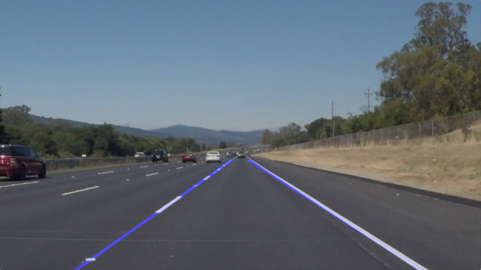

Finding Lane Lines on the Road
=================================

## Overview

When we drive, we use our eyes to decide where to go.  The lines on the road that show us where the lanes are act as our constant reference for where to steer the vehicle.  Naturally, one of the first things we would like to do in developing a self-driving car is to automatically detect lane lines using an algorithm.

In this project I detected lane lines in images using Python and OpenCV and applied same pipeline to videos.

## Reflection
---

### Pipeline

Lane line detection pipeline consists of the following steps: 

1. Convert image to grayscale; 

2. De-noise image using Gaussian filter; 

3. Apply Canny edge detector;

4. Filter found edges leaving only those inside region of interest (where lane lines are expected to be); 

5. Detect lines using Probabilistic Hough Line Transformation; 

6. In `draw_lines` function I separate detected lines into those belonging to the left lane line and those belonging to the right lane line. Based on these two line groups I extrapolated uninterrupted left and right lane lines. 

### Shortcomings

Pipeline described above have several shortcomings though: 

1. It can't handle turns, resulting in very rough approximation and less reliable results.

2. On downhills or uphills lane lines can extend over the horizon or be too short.

### Improvements

Several improvements can be made to the projects:

1. Use convex approximation for turning lanes. 

2. Adjust horizon line in region of interest. 
